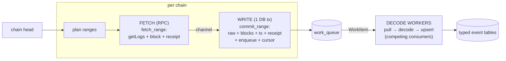
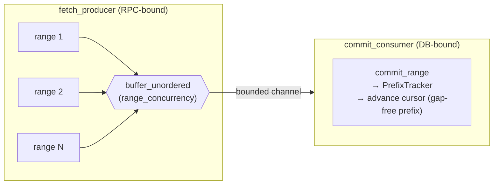

# Sync Performance — How It Works & Optimizations

How the indexer syncs an EVM chain (historical backfill + live tip), and the
optimizations that keep it fast and cheap. Companion to
[ARCHITECTURE.md](ARCHITECTURE.md) (what/why) and [CODEBASE.md](CODEBASE.md) (layout).

---

## 1. The sync pipeline

The same fetch→write→decode path serves both backfill and the live tip. Only the *range
selection* differs.



- **FETCH** (`IngestionService::fetch_range`, [ingestion.rs](crates/services/src/ingestion.rs)):
  pure RPC, no DB. `eth_getLogs` for the range, then `eth_getBlockByNumber(full=true)`
  (timestamp + txs) and `eth_getTransactionReceipt` for the matched blocks/txs.
- **WRITE** (`IngestionService::commit_range`): one atomic tx — raw logs,
  block metas, tx/receipt enrichment, a decode `WorkItem`, and (optionally) the cursor
  advance. Enqueue shares the tx ⇒ exactly-once.
- **DECODE** (`DecodeWorker`, [worker.rs](crates/services/src/worker.rs)): a pool of
  competing consumers pulls work items (`FOR UPDATE SKIP LOCKED`, serial per chain,
  parallel across chains), reads raw, decodes via the chain's ABI, upserts typed rows.
  Decode is a pure function of `(raw, ABI)` ⇒ replayable with zero RPC.

The driver tying FETCH→WRITE together is `run_pipeline`
([plan.rs](bins/indexer-cli/src/plan.rs)). Commands:
- `indexer backfill <chain> <from> <to>` — one bounded pipeline over `[from,to]` + a
  decode worker pool, drains the queue, exits.
- `indexer follow <chain>` / `indexer run` — the live `ingest_loop`
  ([ingest.rs](bins/indexer-cli/src/ingest.rs)): resume from cursor → reorg check → catch
  up to `head − confirmations` → wait on WS/interval → repeat. `run` supervises every
  configured chain and a shared worker pool.

---

## 2. RPC minimization (the cost floor)

Cost is dominated by RPC, so the design fetches the minimum:

- **Filtered `eth_getLogs` only** — one filter per chain unions all contract
  addresses + event topics. Never scans full blocks.
- **Matched data only** — block/tx/receipt fetched *only* for blocks that had a matching
  log, deduped chain-wide and cached in `blocks`/`transactions`/`receipts`.
- **`full=true` block fold** — `eth_getBlockByNumber(full=true)` returns the timestamp
  *and* the block's txs in one call, so tx data piggybacks on the (already-required)
  timestamp fetch instead of a separate `eth_getTransactionByHash`.
- **JSON-RPC batching** — block + receipt lookups are packed up to `max_batch` per HTTP
  round-trip ([batch.rs](crates/source/src/batch.rs)).
- **WS tip, not polling** — `eth_subscribe("logs")` pushes matching logs; the interval
  poll is the fallback.
- **Raw store ⇒ free re-decode** — decode replays from `raw_logs`; a new event/column or
  decode fix costs zero RPC.
- **Cost-aware** — every call runs through a per-provider `CostModel` → `SpendLedger`
  (live `$spent`, free-quota guard).

Reference: ~0.62M Alchemy CU for a 20k-tx full backfill (≈ $0 on the free tier). See
[ARCHITECTURE.md § Cost reference](ARCHITECTURE.md).

---

## 3. Throughput & latency optimizations

These sit on top of the cost floor — same call count and `$spent`, but faster wall-clock
and lower tip latency.

### 3.1 Two-level concurrency

- **`range_concurrency`** (default 4) — several getLogs ranges in flight at once.
- **`aux_concurrency`** (default 8) — within a range, block/receipt batches run
  concurrently. At ~1 matched tx/block these dominate the call count, so overlapping them
  is the big win.

Both are still gated by the `PlanProfile` token bucket
([limiter.rs](crates/source/src/limiter.rs)) — concurrency exists to *fill* the rate
budget, not exceed it.

### 3.2 Decoupled fetch→write pipeline

`run_pipeline` ([plan.rs](bins/indexer-cli/src/plan.rs)) runs FETCH and WRITE on
independent concurrency:

- **`fetch_producer`** — `buffer_unordered(range_concurrency)` of `fetch_range`
  (pure RPC) feeds a bounded channel.
- **`commit_consumer`** — a single writer drains the channel and commits.



A DB commit never blocks an RPC slot, and commits overlap fetches. The earlier design
committed *inside* each RPC slot and barriered every window — so effective RPC
concurrency dropped whenever a range was writing, and the rate budget idled at each
window tail. The decoupled pipeline keeps the rate ceiling saturated.

### 3.3 Contiguous-prefix cursor (`PrefixTracker`)

Ranges commit out of order (concurrent fetches), but the cursor must only move over a
**gap-free prefix** from the start block. `PrefixTracker`
([plan.rs](bins/indexer-cli/src/plan.rs)) holds each committed range until the ranges
before it arrive, then advances the cursor across the whole contiguous run at once,
stamping the highest matched block's hash.

Effect: a mid-run error or shutdown leaves the cursor at a contiguous checkpoint; the
next run re-fetches exactly the missing tail, idempotently (`ON CONFLICT`). No gaps, no
re-scan from `start_block`. Unit-tested for in-order, out-of-order, empty-range, and
highest-hash cases.

### 3.4 Decode off the critical path

`backfill` and `follow` enqueue decode `WorkItem`s and let a worker pool drain them
concurrently with (and after) fetching — decode no longer blocks the fetch loop. Decode
is pure CPU + raw reads; running it in parallel keeps the fetch pipeline RPC-bound.

### 3.5 Self-sizing getLogs ranges

`fetch_records` ([client.rs](crates/source/src/client.rs)) tracks an EWMA of observed
log density (logs/block) per chain and seeds each getLogs sub-span to land at ~80% of the
provider result cap; it regrows on clean pages and still halves on overflow.

Effect: a dense contract no longer pays a wasted over-cap round-trip (+ backoff) before
splitting — the first request is already sized to fit. Sparse contracts still use full
`max_getlogs_blocks` spans.

### 3.6 Cheap tip reorg detection

On the WS tip path, probing block hashes every loop tick is wasteful. Instead
([ingest.rs](bins/indexer-cli/src/ingest.rs), [tip.rs](bins/indexer-cli/src/tip.rs)):

- The WS stream carries the chain's **`removed`** flag (`TipLog`). A `removed:true` log
  raises a reorg signal → immediate hash probe + rollback.
- The periodic hash-probe runs only as a safety net (every `REORG_PROBE_TICKS`, default
  16) on the WS path; every tick on the poll path (no cheap signal there).

### 3.7 Idle-WS head skip

When WS is connected and there's nothing to reconcile or confirm, the loop skips the
per-tick `eth_blockNumber` head poll entirely (`TipState::should_poll_head`) and just
waits on the stream — near-zero RPC on an idle chain. Head is polled only when about to
act (poll mode, a reconcile sweep, or a pending pushed log).

Per-tick decision flow (`ingest_loop`), showing where RPC is skipped:

```mermaid
flowchart TD
    tick([loop tick]) --> sub[ensure WS subscribed]
    sub --> rsig{removed signal<br/>or poll mode<br/>or every Nth tick?}
    rsig -->|no| skipr["skip reorg probe<br/>(no block_hash RPC)"]
    rsig -->|yes| probe[reorg.check → rollback if forked]
    skipr --> hp
    probe --> hp{should_poll_head?<br/>poll mode / reconcile / pending}
    hp -->|no, idle WS| wait
    hp -->|yes| head[poll head → safe = head − confirmations]
    head --> beh{safe ≥ next?}
    beh -->|no| wait
    beh -->|yes| catch["catch_up:<br/>run_pipeline (fetch+write+cursor)<br/>or zero-RPC checkpoint"]
    catch -->|still behind| beh
    catch -->|caught up| wait([wait: WS log / interval / shutdown])
    wait --> tick

---

## 4. Reorg & restart safety

- Every row carries `block_hash`; the cursor stores the last block's hash.
- Reorg (WS `removed` or hash mismatch within the `confirmations` window) →
  `DELETE ≥ fork` from event/raw/blocks tables, rewind the cursor, re-fetch.
- Restart resumes from the cursor's contiguous-prefix checkpoint — no re-fetch of indexed
  ranges, no gaps.
- At-least-once decode is harmless: upserts on the PK `(chain_id, block_number,
  log_index)` are idempotent.

---

## 5. Tuning knobs (`config.toml [indexer]`)

| Knob | Default | Effect |
|---|---|---|
| `range_concurrency` | 4 | getLogs ranges in flight (backfill throughput) |
| `aux_concurrency` | 8 | block/receipt batches per range (dominant call class) |
| `batch_size` | 500 | decoder write batch |
| `tip_interval_secs` | 6 | poll/idle wait at the tip |

Provider caps live in `[chains.source.limits]` (`max_rps`, `max_cu_per_sec`,
`max_batch`, `max_getlogs_blocks`, `max_getlogs_results`, `monthly_quota_cu`) and bound
the token bucket + self-sizing ranges. All defaults are sane on a free tier.

---

## 6. Verifying performance

- **Equal-volume:** run a fixed historical range before/after a change; RPC call count +
  `SpendLedger` total must be **identical** (concurrency changes ordering, not volume),
  wall-clock lower.
- **Gap-free cursor:** kill mid-backfill → cursor sits at a contiguous prefix, re-run is
  idempotent.
- **Self-sizing:** dense contract → no repeated over-cap getLogs round-trips.
- **Tip RPC:** idle WS chain → no `block_hash`/`eth_blockNumber` per tick; reorg still
  caught via `removed` and the periodic probe (drive with anvil).
