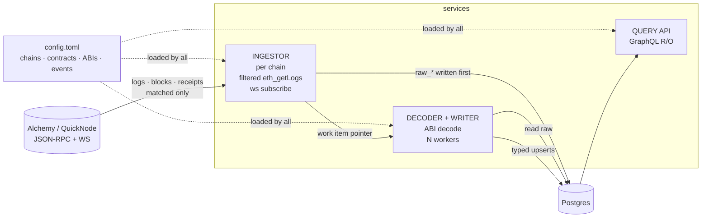
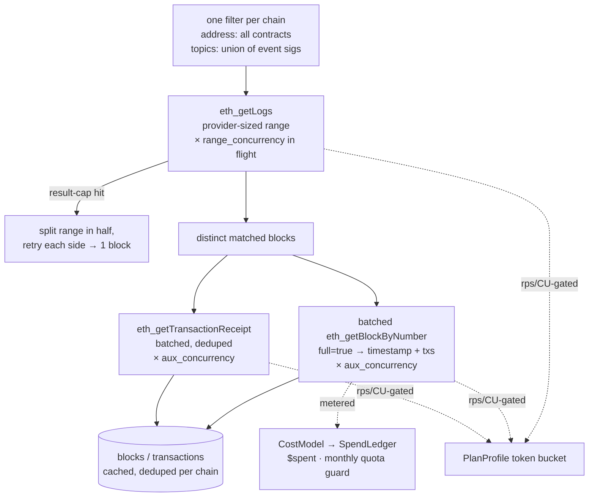
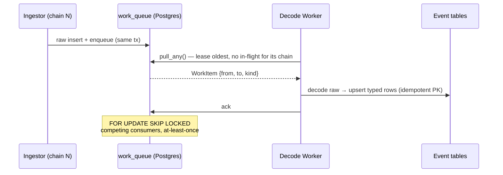

# Topic0 — EVM Indexer

Config-driven EVM log indexer in Rust. Indexes **only** the contracts and events
you declare in `config.toml` — never full blocks — to keep paid RPC usage
(Alchemy/QuickNode compute units & credits) low. Logs are fetched with filtered
`eth_getLogs`, decoded against their ABI at runtime (no codegen), and written as
**structured, typed rows** into Postgres.

| Goal | How |
|---|---|
| **Minimal RPC spend** | Filtered `eth_getLogs` over wide adaptive ranges; timestamps fetched once & cached; tx data piggybacks the block fetch; WebSocket at the tip, not polling. Every call metered through a per-provider cost model into a spend ledger with a monthly free-quota guard. |
| **Fast, same cost** | Two-level parallel pipeline (concurrent getLogs ranges × concurrent block/receipt RPCs per range) saturates the rate budget instead of idling. Same call count & `$spent` as serial — concurrency changes ordering, not volume. |
| **Pay RPC once** | Raw logs persisted before decode → re-decode / resync (new event, bug fix, added column) replays from disk with **zero** new RPC. |
| **Reorg-safe** | Block hashes tracked per row; reorgs are cheap point deletes + re-index within the confirmation window. |
| **Swappable seams** | RPC source, storage read layer, and query protocol all behind traits. Default: Alchemy/QuickNode + Postgres + GraphQL. |
| **Multi-chain** | One deployment, `chain_id` everywhere, one ingest task per chain. |
| **Observable** | Optional Prometheus `/metrics` endpoint (RPC calls, spend, queue depth, decode/query latency, `build_info`) — enable with `[indexer] metrics_listen`. |

> Full design rationale: [ARCHITECTURE.md](ARCHITECTURE.md). Code layout: [CODEBASE.md](CODEBASE.md).

## Contents

- [Architecture](#architecture)
- [Quick start](#quick-start)
- [Configuration](#configuration)
- [Query API](#query-api)
- [Metrics](#metrics)
- [Docker Compose](#docker-compose)
- [Development](#development)

---

## Architecture

Three services + a Postgres-backed queue. The ingestor fetches filtered logs and
enqueues pointers; decode workers read the raw logs, decode them, and upsert typed
rows; the query service serves GraphQL over those rows.



<details>
<summary><b>Fetch path</b> (the cost-saver) — diagram</summary>

Both levels of the diagram run concurrently — `range_concurrency` getLogs ranges in
flight, and `aux_concurrency` block/receipt RPCs per range — all gated by the same
`PlanProfile` token bucket so throughput fills the rate budget without exceeding it.



</details>

<details>
<summary><b>Queue &amp; decode</b> (parallel across chains, serial within a chain) — diagram</summary>



</details>

---

## Quick start

```bash
cp .env.example .env          # fill ALCHEMY_HTTP / ALCHEMY_WS
cp config.toml.example config.toml

just pg-up                    # throwaway local Postgres on :55432
just migrate                  # ABI → DDL: create event tables
just backfill 19000000 19010000        # index a fixed range on chain 1 (default)
just backfill 19000000 19010000 8453   # …or pass a chain id explicitly
just run 4                    # or: supervisor — ingest all chains + 4 decode workers
just query                    # GraphQL at :8080
```

Run `just` with no args to list every recipe.

### Common commands

| Recipe | What it does |
|---|---|
| `just migrate` / `just migrate-dry` | Apply / preview ABI→DDL schema diff |
| `just backfill <from> <to>` | Index a height range (one chain) |
| `just resync <from> <to>` | Re-decode from `raw_*`, **zero RPC** |
| `just follow` | Track the tip via WS, resume on restart |
| `just run <workers>` | Supervisor: ingest all chains + in-proc decode pool |
| `just decode <workers>` | Standalone decode-worker pool (scale-out) |
| `just query` | Start the GraphQL server |

Docker compose mirrors these as profiles: `just up indexer query`,
`just scale-decode 4`, `just logs`.

---

## Configuration

`config.toml` is the single source of truth — it drives schema (`migrate`) and
every runtime service. Secrets are `${ENV}` placeholders, never inline. Copy
`config.toml.example` to start.

```toml
[indexer]
log_level         = "info"    # tracing filter; RUST_LOG overrides
batch_size        = 500       # decoder write batch into Postgres
range_concurrency = 4         # getLogs ranges in flight at once (backfill pipeline)
aux_concurrency   = 8         # concurrent block/receipt RPCs per range (rps-gated)
tip_interval_secs = 6         # tip poll cadence (run/follow); CLI --interval overrides
# metrics_listen  = "0.0.0.0:9090"   # Prometheus /metrics endpoint; omit = exporter off

[database]
url       = "${DATABASE_URL}"
max_conns = 16

[queue]
kind         = "postgres"     # work_queue table, FOR UPDATE SKIP LOCKED, polled
poll_ms      = 50             # worker poll interval while items are flowing
poll_idle_ms = 1000           # slower poll once the queue drains; returns to poll_ms on new work

[query]
api          = "graphql"
listen       = "0.0.0.0:8080"
expose       = "finalized"    # finalized | provisional — read visibility
cache_ttl_ms = 1000           # in-process read-cache TTL; 0 disables caching

[[chains]]
id            = 1
name          = "ethereum"
kind          = "evm"         # chain family (selects the adapter); "evm" is the only kind today
confirmations = 12            # unfinalized window for reorg safety

  [chains.source]
  kind = "alchemy"            # provider impl: alchemy | quicknode | generic_rpc | free_node
  http = "${ALCHEMY_HTTP}"
  ws   = "${ALCHEMY_WS}"      # optional; present → WS tip subscription, absent → poll fallback

    [chains.source.limits]    # PlanProfile — provider caps; omit the block for defaults
    max_rps             = 8            # request-rate ceiling (token bucket)
    max_cu_per_sec      = 330          # compute-unit/sec ceiling (Alchemy)
    max_batch           = 100          # max JSON-RPC batch size the plan accepts
    max_getlogs_blocks  = 10           # getLogs range seed/ceiling (free tier is small)
    max_getlogs_results = 10_000       # result-count cap → triggers range halving
    monthly_quota_cu    = 300_000_000  # free-quota guard in the spend ledger

  [[chains.contracts]]
  address     = "0xA0b86991c6218b36c1d19D4a2e9Eb0cE3606eB48"   # USDC
  abi         = "abis/erc20.json"
  events      = ["Transfer", "Approval"]   # subset of ABI; omit = all events
  start_block = 19_000_000                 # earliest block to scan — REQUIRED on ≥1 contract
  # functions = ["transfer"]               # decode calldata of these fns into columns; omit = none
  # table     = "usdc_transfer"            # table-name override (default evt_<contract>_<event>)
```

Add more `[[chains]]` blocks for multi-chain; each can use a different provider
and plan. `source.kind` picks the `LogSource`/`CostModel` impl;
`[chains.source.limits]` sets the plan caps that the client self-tunes against.

<details>
<summary><b>Field reference</b> — full table of every non-obvious knob</summary>

Only fields whose meaning isn't obvious from the example are listed; anything not
shown takes the default above.

**`[indexer]`**

| Field | Default | Meaning |
|---|---|---|
| `batch_size` | 500 | Rows per decoder upsert batch into Postgres. |
| `range_concurrency` | 4 | getLogs ranges fetched concurrently during backfill. Higher fills the rate budget faster; **does not** change call count or `$spent`. |
| `aux_concurrency` | 8 | Per-range concurrent `getBlockByNumber`/`getTransactionReceipt` calls. The dominant wall-clock win at ~1 matched tx/block; rps-gated, so volume is unchanged. |
| `tip_interval_secs` | 6 | Poll cadence at the tip for `run`/`follow` when WS is unavailable. CLI `--interval` overrides. |
| `metrics_listen` | _(unset)_ | Address for the Prometheus `/metrics` scrape endpoint (e.g. `0.0.0.0:9090`). Omit to disable the exporter. Honoured by every `indexer` command and `indexer-query`. |

**`[queue]`**

| Field | Default | Meaning |
|---|---|---|
| `poll_ms` | 50 | Worker poll interval while items keep coming. |
| `poll_idle_ms` | 1000 | Slower poll workers back off to when a pull returns nothing; snaps back to `poll_ms` once work resumes. |

**`[query]`**

| Field | Default | Meaning |
|---|---|---|
| `expose` | `finalized` | Read watermark. `finalized` hides rows inside the `confirmations` window (reorg-unsafe); `provisional` exposes them. |
| `cache_ttl_ms` | 1000 | TTL of the in-process read cache over the query path. `0` disables caching entirely. |

**`[[chains]]`**

| Field | Default | Meaning |
|---|---|---|
| `kind` | `evm` | Chain family — selects the chain adapter. `evm` is the only kind built today. Distinct from `source.kind` (the RPC provider). |
| `confirmations` | 12 | Depth of the unfinalized window. Reorgs are only acted on (and `finalized` reads hidden) within this many blocks of the tip. |

There is **no chain-level `start_block`** — the scan start is derived from the
contracts (see below).

**`[chains.source]` / `[chains.source.limits]`** — the `PlanProfile`. Omit the
`limits` block to take built-in defaults; otherwise set your plan's **real** caps so
the client self-tunes without tripping provider 429s.

| Field | Meaning |
|---|---|
| `kind` | Provider impl: `alchemy`, `quicknode`, `generic_rpc`, `free_node`. Picks both the RPC client and its `CostModel`. |
| `ws` | WS endpoint. Present → tip tracked via `eth_subscribe`; absent → poll fallback (`tip_interval_secs`). |
| `max_rps` / `max_cu_per_sec` | Token-bucket ceilings on request rate and Alchemy compute-units/sec. |
| `max_batch` | Largest JSON-RPC batch the plan accepts (block/receipt lookups are packed up to this). |
| `max_getlogs_blocks` | getLogs range — **seeded** here and shrunk only on result-cap hits. Free tiers are small (e.g. 10); paid tiers allow 2000+. |
| `max_getlogs_results` | Result-count cap. A page that hits it makes the range halve and retry, down to a single block. |
| `monthly_quota_cu` | Free monthly CU/credit allotment. Feeds the `SpendLedger` guard that slows/stops before the allotment is blown. |

**`[[chains.contracts]]`**

| Field | Required | Meaning |
|---|---|---|
| `address` | yes | Contract address (checksummed or lowercase). All addresses on a chain are unioned into one getLogs filter. |
| `abi` | yes | Path to the ABI JSON, relative to `config.toml`. Only `event` (and, if `functions` is set, `function`) entries are read. |
| `events` | no | ABI event names to index, exact match. Omit to index **all** events in the ABI. Each event → one table. |
| `functions` | no | ABI function names whose tx calldata to decode into columns. Omit/empty = decode no calldata. |
| `start_block` | **≥1 per chain** | Earliest block to scan for this contract. The chain's scan start is the **minimum** across its contracts; config validation fails if no contract sets one. |
| `table` | no | Override the generated table name (default `evt_<contract>_<event>`). |

</details>

<details>
<summary><b>Preparing config &amp; ABIs</b> — step-by-step from zero</summary>

Steps from zero to an indexable config:

1. **Copy the template.**

   ```bash
   cp config.toml.example config.toml
   mkdir -p abis
   ```

2. **Get the contract ABI** as JSON and drop it in `abis/`. Sources:

   ```bash
   # from Etherscan (verified contracts) — needs an API key
   curl -s "https://api.etherscan.io/api?module=contract&action=getabi&address=0xA0b8...&apikey=$ETHERSCAN_KEY" \
     | jq -r '.result' > abis/erc20.json

   # or from a local Foundry/forge build artifact
   jq '.abi' out/ERC20.sol/ERC20.json > abis/erc20.json
   ```

   The file must be the **ABI array** (or an object with an `.abi` field). Only
   `event` entries are used; functions/constructors are ignored. One ABI can be
   reused across many contracts (e.g. one `erc20.json` for every ERC-20).

3. **Declare the chain** — `id`, `name`, `confirmations`, `start_block`, and a
   `[chains.source]` with `kind` + `${ENV}` endpoints. Set
   `[chains.source.limits]` to your provider plan's real caps (see the cost model
   for your `kind`).

4. **Declare each contract** under `[[chains.contracts]]`:

   ```toml
   [[chains.contracts]]
   address = "0xA0b86991c6218b36c1d19D4a2e9Eb0cE3606eB48"  # checksummed or lowercase
   abi     = "abis/erc20.json"          # path relative to config.toml
   events  = ["Transfer", "Approval"]   # by ABI event name; omit = all events
   # table = "usdc_transfer"            # override evt_<contract>_<event>
   # start_block = 19_500_000           # per-contract start override
   ```

   - `events` names must match the ABI exactly. Each event → one table
     `evt_<contract>_<event>` (or your `table` override).
   - The getLogs filter unions **all** contract addresses + event topic0s per
     chain → one call covers every contract.

5. **Validate** — the migrator parses every ABI and computes the schema diff:

   ```bash
   just migrate-dry        # parse ABIs + print DDL plan, apply nothing
   just migrate            # create the event tables
   ```

   A bad ABI path, malformed JSON, or an `events` name absent from the ABI fails
   here before any RPC is spent.

> Adding a new event or contract later: edit `config.toml`, drop/extend the ABI,
> `just migrate`, then `just resync <from> <to>` to backfill the new columns from
> `raw_*` with **zero** new RPC.

</details>

### Environment variables

Copy `.env.example` to `.env`. Compose reads it, and `config.toml` `${VAR}`
placeholders resolve from it too.

| Var | Purpose |
|---|---|
| `DATABASE_URL` | Postgres DSN used by `database.url` |
| `POSTGRES_USER` / `POSTGRES_PASSWORD` / `POSTGRES_DB` / `POSTGRES_PORT` | Compose-provisioned DB creds |
| `ALCHEMY_HTTP` / `ALCHEMY_WS` | RPC source endpoints referenced by `config.toml` |
| `RUST_LOG` | Tracing filter (e.g. `info`, `debug`) |
| `CHAIN_ID` | Default chain for CLI recipes |
| `QUERY_PORT` | GraphQL server port |

---

## Query API

`just query` (or the `query` compose profile) serves a read-only GraphQL API on
`:8080`, with a playground at the same address. The schema is **built at runtime
from the configured ABIs** — one typed object + query field per event/transaction
table, so column names and types match your contracts exactly.

Each queryable table exposes a field with these arguments:

| Arg | Type | Meaning |
|---|---|---|
| `first` | Int | Page size (default 100). |
| `after` | String | Opaque keyset cursor from a prior `endCursor`. |
| `orderBy` | `ASC` \| `DESC` | Sort on block position `(height, log_index)`. Default `ASC`. |
| `chainId` | Int | Restrict to one chain. |
| `fromHeight` / `toHeight` | Int | Inclusive block-height bounds. |
| `where` | `[FilterInput!]` | Arbitrary column predicates: `{column, value, op}` where `op` ∈ `EQ, NEQ, GT, GTE, LT, LTE`. |

The field returns a `<table>_connection`: `nodes` (typed rows), `endCursor`,
`hasNext`, and a lazy `totalCount` (an extra `count(*)`, only when selected). On
**event** tables, `nodes` also exposes nested `transaction` and `receipt` objects
(joined on `(chain_id, tx_hash)`) — fetched only when selected.

```graphql
{
  evt_usdc_transfer(
    first: 50
    orderBy: DESC
    chainId: 1
    fromHeight: 19000000
    where: [{ column: "from", value: "0x0000000000000000000000000000000000000000" }]
  ) {
    totalCount
    hasNext
    endCursor
    nodes {
      from
      to
      value
      transaction { hash gas_price }
      receipt { status gas_used }
    }
  }
}
```

Reads are gated at the `[query].expose` watermark (`finalized` hides rows inside the
`confirmations` window) and cached for `[query].cache_ttl_ms`.

---

## Metrics

Set `[indexer] metrics_listen` (e.g. `0.0.0.0:9090`) to install a Prometheus
exporter serving `/metrics`. Every `indexer` subcommand and `indexer-query` honour
it; omit the field to leave the exporter off. Exposed series include RPC call counts,
metered spend, queue depth, and decode/query latency histograms, plus a `build_info`
gauge labelled with version and git SHA.

---

## Docker Compose

Compose ships the whole stack as **profiles** — each service starts only when its
profile is named, so you compose exactly the pieces you need. All app containers
share one image (built from the `Dockerfile`), mount `config.toml` read-only, and
read `.env`.

| Profile | Service | What it does |
|---|---|---|
| `db` | `postgres` | Postgres only (`:5432`, `pgdata` volume) |
| `migrate` | `migrate` | One-shot: diff ABIs → apply DDL, then exit |
| `indexer` | `indexer` | Supervisor: per-chain ingest loops + in-process decode pool |
| `decode` | `decode` | Standalone decode-worker pool (scale out) |
| `query` | `query` | GraphQL read API on `:8080` |

`postgres` is attached to every app profile and gated by a healthcheck, so any app
service waits for the DB to be ready before booting.

### Setup

```bash
cp .env.example .env                 # fill ALCHEMY_HTTP / ALCHEMY_WS, DB creds
cp config.toml.example config.toml   # mounted read-only into every container
docker compose build                 # or: just docker-build
```

### Run

```bash
# 1. apply the schema once (one-shot, exits 0)
docker compose --profile migrate up

# 2. start indexing + the query API
docker compose --profile indexer --profile query up -d
#   equivalently:  just up indexer query

# tail logs / stop
docker compose logs -f               # just logs
docker compose down                  # just down
```

### Scaling decode throughput

For many or fast-blocktime chains, run the ingest supervisor and a separate,
horizontally-scaled decode pool (competing consumers of the shared `work_queue`):

```bash
docker compose --profile indexer up -d
docker compose --profile decode up -d --scale decode=4    # just scale-decode 4
```

`WORKERS` (default 4) sets the in-process pool size for `indexer`/`decode`.

### Configuration knobs

Compose reads these from `.env` (see the [environment variables](#environment-variables)
table): `POSTGRES_*`, `DATABASE_URL` (overridden to point at the `postgres` service),
`RUST_LOG`, `QUERY_PORT`, plus `WORKERS` shown above. App containers
get a 45s `stop_grace_period` so in-flight ranges/decodes drain on `SIGTERM`.

---

## Development

```bash
just build      # cargo build --workspace
just test       # cargo test --workspace
just clippy     # -D warnings
just fmt        # cargo fmt --all
just ci         # fmt-check + clippy + test (what CI runs)
```
